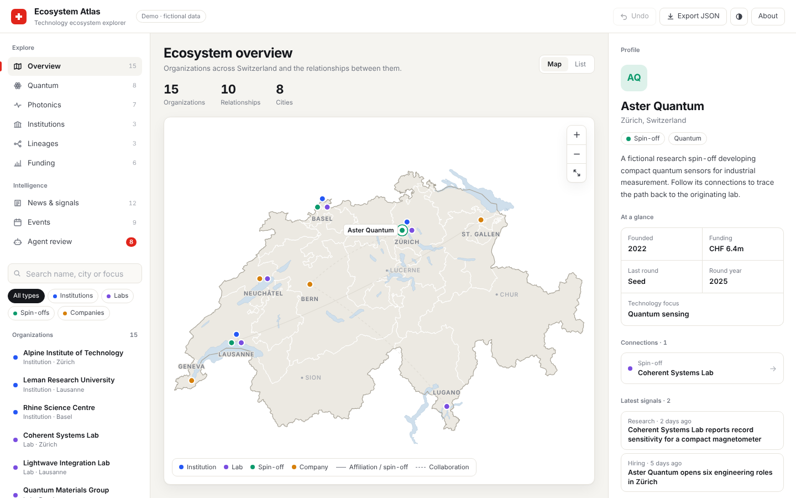
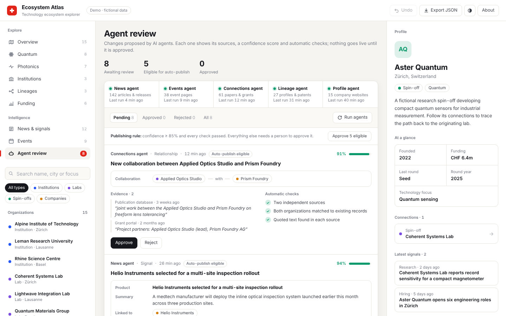
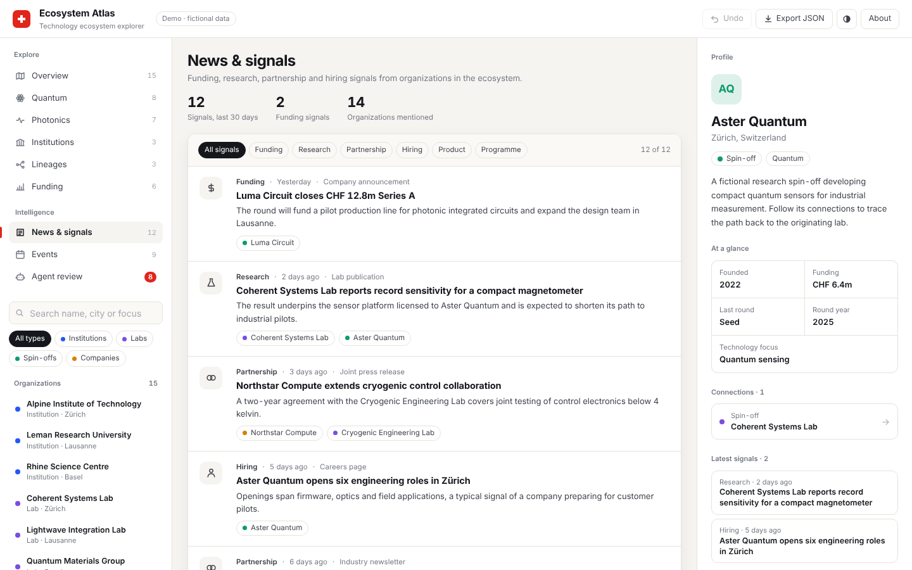
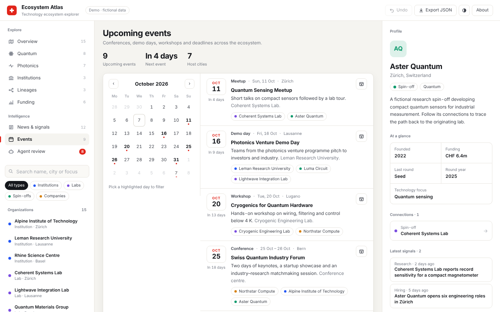
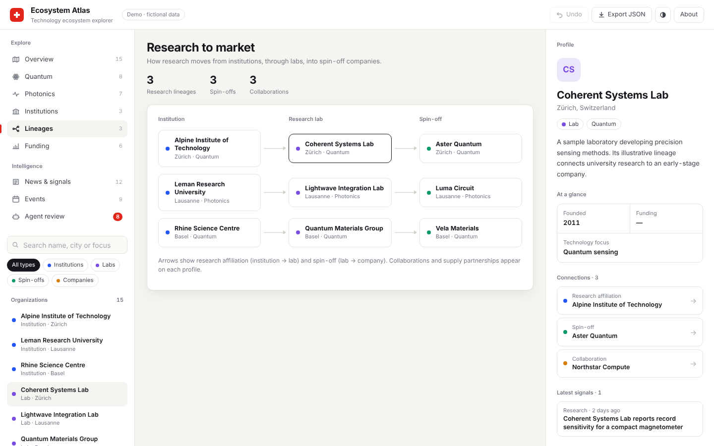
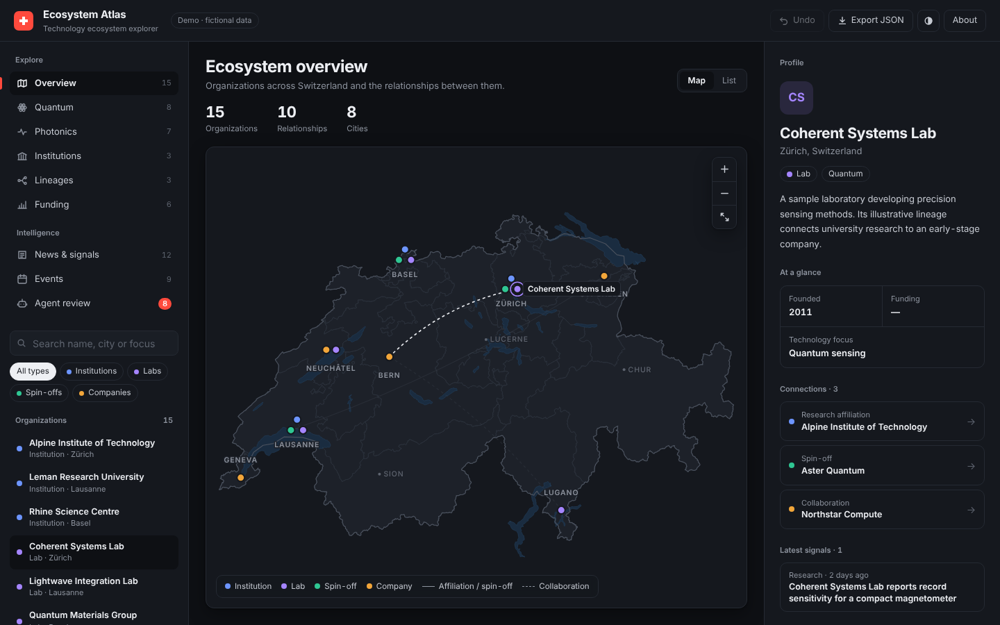

# Ecosystem Atlas

**An interactive explorer for technology ecosystems, research networks and emerging companies.**

**[▶ Open the live demo](https://pymak.github.io/ecosystem-atlas/)**: runs in the browser, nothing to install.

Ecosystem Atlas is a neutral portfolio adaptation of an ecosystem intelligence platform I worked on during my internship. It demonstrates how fragmented information about institutions, laboratories and companies can be organized into a connected, searchable interface.

This public edition is a standalone demonstration using fictional organizations and sample data. It contains no employer branding, internal records or connections to the original platform.

  

  
  

  
  

## The problem

Understanding a technology ecosystem involves more than listing companies. Research institutions, laboratories, spin-offs and established businesses are connected through affiliations, technology transfer, collaborations and supply relationships.

The goal is to make those connections easier to explore: where organizations operate, what they work on, how they relate to one another and how research can move toward commercialization.

## Features

- **Ecosystem map:** explore fictional organizations on an accurate map of Switzerland (country border, all 26 cantons and the major lakes), with smooth zoom, drag-to-pan, scroll and double-click zoom, hover details and fly-to on selection.
- **Technology views:** browse quantum and photonics organizations separately.
- **Search and filters:** find organizations by name, city or technology focus, and filter by organization type.
- **Organization profiles:** inspect descriptions, technology focus, sample funding and connected organizations.
- **Research lineages:** follow illustrative institution → laboratory → spin-off pathways, with collaborations labeled separately.
- **Funding explorer:** compare fictional financing rounds.
- **News & signals:** a feed of funding, research, partnership, hiring, product and programme signals, filterable by category and linked to the organizations involved. Unconfirmed reports are labelled separately from confirmed announcements.
- **Events calendar:** a month calendar and agenda of upcoming conferences, demo days, workshops and deadlines. Pick a day to filter, and export any event to your own calendar as an `.ics` file.
- **Agent review queue:** simulated AI agents propose new signals, events, relationships and profile updates. Each proposal shows the exact change, quoted evidence with sources, a confidence score and automatic checks. Approving it updates the map, feed, calendar and profiles live, and every decision can be undone.
- **Profiles that bring it together:** each organization's profile lists its latest signals and upcoming events.
- **Map and table views:** switch between geographic exploration and a structured list.
- **Profile editing:** edit sample records, receive save feedback and undo changes made during the current session.
- **Data export:** download the sample dataset and local edits as JSON.
- **Light and dark themes:** follows the system setting, with a manual toggle.

The demo contains 15 fictional organizations across institutions, laboratories, spin-offs and companies, plus 12 news signals and 9 upcoming events.

## Run locally

Use the [live demo](https://pymak.github.io/ecosystem-atlas/), or run it locally:

1. Download or clone this repository.
2. Open `index.html` in a current browser.

No installation, build step, account or server is required. The demo is self-contained and can run offline.

## Suggested walkthrough

1. Select **Aster Quantum** on the overview map or find it using search.
2. Open its profile and follow the connection to **Coherent Systems Lab**.
3. Switch to **Lineages** to explore the institution-to-spin-off pathway.
4. Open **Funding** to compare sample rounds.
5. Open **News & signals**, filter by **Funding**, and select an organization tag to open its profile.
6. Open **Events**, pick a highlighted day in the calendar, and add an event to your calendar.
7. Open **Agent review**. Approve the Applied Optics Studio and Prism Foundry collaboration, then select **Show on map** to see the new link. Reject the low-confidence spin-off proposal and read why its checks failed.
8. Edit a profile, save the change and use **Undo**.
9. Switch to **List** to browse the same ecosystem in a table.

## Implementation

| Component | Implementation |
| --- | --- |
| Interface | HTML and CSS |
| Application logic | Vanilla JavaScript |
| Map | Inline SVG drawn from official Swiss boundary data (LV95 projection), simplified at build time |
| Relationship diagrams | HTML/CSS and inline SVG |
| Sample dataset | Embedded JavaScript objects |
| Local persistence | Browser `localStorage`, when available |
| Data export | JSON download (organizations, relationships, signals, events) |
| Calendar export | Standard iCalendar (`.ics`) file per event |

Organizations are placed at the real coordinates of their city (converted from WGS84 to the Swiss LV95 grid). When several share a city, they are arranged in a small ring around it. Markers and labels keep a constant on-screen size at every zoom level.

Organizations have stable identifiers. Relationships reference those identifiers and carry explicit types, allowing the interface to distinguish research affiliations, illustrative spin-offs, collaborations and supply partnerships.

The public demo has no external libraries, network requests, backend or database connection.

## How AI agents could power the platform

The **Agent review** view is a working mock of how the platform could be kept up to date by AI agents. The agents in the demo are simulated, but the review flow, the publishing rule and the effects on the data are real.

**The basic loop**

1. **Collect.** Scheduled agents check sources: news and press releases, company and university websites, job boards, event pages, publication and patent databases, grant portals and the commercial register.
2. **Extract.** A model turns each relevant item into a structured change, such as a signal, an event, a typed relationship or a profile field update, together with the exact quote that supports it.
3. **Match.** The change is linked to existing organizations (for example, "EPFL spin-off Luma" is matched to *Luma Circuit*), or flagged as a possible new organization.
4. **Check.** Automatic checks verify that the quote exists in the source, count independent sources, look for duplicates and conflicts with existing records, and produce a confidence score.
5. **Review.** Changes that meet the publishing rule (confidence ≥ 85% and every check passed) can be published automatically. Everything else waits for a person to approve it.

**Agents in the demo**

| Agent | Watches | Proposes |
| --- | --- | --- |
| News | Articles, press releases, company posts | Signals and confirmations of earlier reports |
| Events | Event pages, university calendars, grant programmes | Calendar events and deadlines |
| Connections | Co-authored papers, joint grants, trade press | Collaborations and supply partnerships |
| Lineage | Founder affiliations, patents, technology-transfer announcements | Research affiliations and spin-off links |
| Profile | Company websites and register entries | Profile field updates |

**Rules that keep it trustworthy**

- **No source, no record.** Every proposal carries the quoted evidence it was built from. Claims without a source are dropped.
- **Evidence over inference.** A spin-off link needs evidence of technology transfer or a licence, not just a founder's past affiliation. The demo includes a proposal that fails for exactly this reason.
- **Confirmed vs. unconfirmed.** A single media report is shown as *Unconfirmed* until an official or primary source confirms it.
- **Reversible.** Every decision is recorded and can be undone.

### Where the agents would get their data

The demo does not connect to any of these sources. This is the plan for a production version, built mostly on free, openly accessible data (access terms as of October 2026):

| Source | Used for | Access |
| --- | --- | --- |
| Swiss Official Gazette of Commerce (SOGC) API | New companies, capital increases, register changes, used to confirm funding | Free, no login |
| Zefix (central business name index) | Company identity and register details | Free, credentials requested from the Federal Office of Justice |
| OpenAlex, Crossref, arXiv | Author affiliations, co-authorship between organizations | Free (OpenAlex: optional free key for higher limits) |
| Swiss patent register raw data (IPI), EPO Open Patent Services | Patent owners and transfers, used as evidence for spin-offs | Free (EPO: registration, 4 GB per week) |
| SNSF Data Portal, ARAMIS, CORDIS | Funded projects and their partners, and grant deadlines | Free open data |
| Startup news RSS (e.g. startupticker.ch), company and university newsrooms | Funding, product and hiring signals, and events | Public feeds: store headline, summary and link only |
| ORCID Public API | Researcher affiliations | Free for non-commercial use, commercial use needs membership |

Sources are ranked by reliability: official registers confirm a change on their own, an organization's own announcement is strong evidence, and press reports stay *Unconfirmed* until a stronger source backs them up. Paid databases (Crunchbase, Dealroom, PitchBook) could be added under licence. Sites that forbid scraping, such as LinkedIn, are excluded.

## Data and scope

All organization names, histories, relationships, financial figures, news items, events and agent proposals are fictional. Signal and event dates are set relative to the day you open the demo, so the feed and calendar always look current. Markers sit at real Swiss city locations, but the organizations themselves are invented. No relationship is presented as externally verified.

Edits and review decisions are stored only in the current browser when local storage is available. Otherwise, they last for the current session. Undo history applies to the current session. To restore the starting dataset, select **About this demo → Reset demo data**.

This portfolio edition demonstrates the interaction and data exploration concepts. Production authentication, backend authorization, shared persistence, workbook synchronization and multi-user collaboration are outside its scope.

## Map data

Swiss boundaries (country, cantons, lakes) come from the Federal Statistical Office (BFS/OFS) and swisstopo, via the open-source [`swiss-maps`](https://github.com/interactivethings/swiss-maps) package (2024 boundaries). They were simplified and embedded in `index.html`, so the demo still needs no network connection.

## Project context

The internship project involved exploring how technology ecosystem information could be made useful through maps, structured stakeholder profiles and relationship views. This neutral adaptation preserves those concepts while providing an independent demonstration suitable for a public portfolio.

The repository documents this demonstration's capabilities. It does not claim to reproduce the original production system or establish sole authorship of the internship project.
